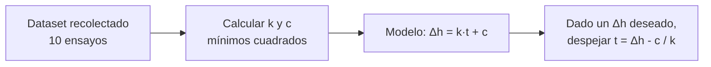
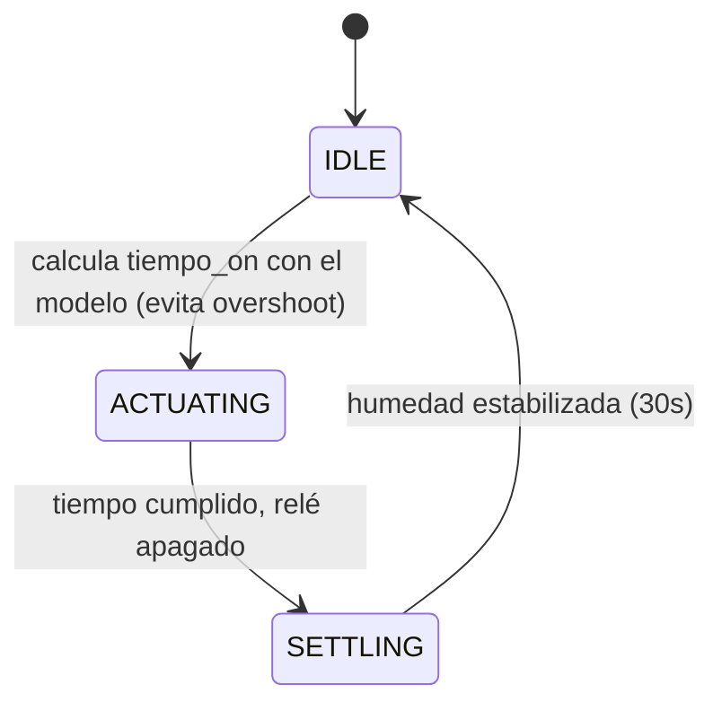

# Control Predictivo de Humidificador con Regresión Lineal

Proyecto de experimentación con Arduino: modelar y predecir el efecto de un humidificador sobre la humedad relativa de un ambiente, usando regresión lineal implementada desde cero en C++ embebido.

## Motivación

Mi primer enfoque fue control por umbral (threshold): encender el humidificador cuando la humedad bajara de cierto valor, apagarlo al alcanzarlo. El problema fue el retraso de lectura del sensor DHT11 (una lectura cada 2 segundos): el sistema detectaba, por ejemplo, 60% y activaba el humidificador con meta de 63%, pero para cuando llegaba la siguiente lectura la humedad ya había subido a 70% — un sobrepaso (overshoot) que mi planta no toleraba bien.

Consideré usar TinyML para predecir la trayectoria de humedad y anticipar el apagado, pero no tenía tiempo suficiente para recolectar un dataset lo bastante grande para entrenar un modelo así de forma confiable. Opté por una alternativa más simple y pragmática: en vez de reaccionar al umbral en tiempo real, **predecir de antemano cuánto tiempo encender el humidificador** para llegar al objetivo sin pasarme, usando un modelo de regresión lineal ajustado con un dataset pequeño (10 ensayos).

## Objetivo

Diseñar un sistema de control que, dado un objetivo de humedad, calcule automáticamente cuánto tiempo debe permanecer encendido el humidificador para alcanzarlo — evitando el sobrepaso que producía el control reactivo por umbral, sin necesitar el volumen de datos que hubiera requerido un enfoque de TinyML.

- **Variable objetivo (dependiente):** cambio en humedad relativa (Δh, %)
- **Variable predictora (independiente):** tiempo de encendido del humidificador (segundos)

## Hardware utilizado

- Arduino (con soporte para DHT y GPIO)
- Sensor de humedad/temperatura DHT11 (pin 5), con lectura cada 2 segundos
- Relé para controlar el humidificador (pin 3)
- Humidificador ultrasónico estándar

## Archivos del proyecto

| Archivo | Descripción |
|---|---|
| `extract_data.ino` | Recolecta el dataset: enciende el humidificador por un tiempo dado (comando serial `ON <ms>`), espera a que la humedad se estabilice, y registra el cambio resultante en formato CSV. |
| `lin_reg_control.ino` | Ajusta una regresión lineal por mínimos cuadrados sobre el dataset recolectado, y usa el modelo para predecir cuánto tiempo encender el humidificador y alcanzar un objetivo de humedad, evitando el sobrepaso del control por umbral. |
| `pi_hum.ino` | Implementación alterna con un controlador PI (proporcional-integral) clásico de teoría de control, como punto de comparación. |

## Metodología

1. **Recolección de datos** (`extract_data.ino`): se realizaron 10 ensayos encendiendo el humidificador por distintos tiempos (10 a 120 segundos), registrando la humedad antes y después de un período de estabilización.

2. **Ajuste del modelo** (`lin_reg_control.ino`): con los 10 pares (tiempo, Δhumedad), se calculó la recta de regresión por mínimos cuadrados directamente en el microcontrolador:

3. **Control predictivo activo**: en vez de reaccionar a cada lectura (y arriesgarse al sobrepaso por el retraso de 2 segundos), el sistema sensa la humedad, calcula cuánto falta para el objetivo, y usa el modelo para decidir de antemano cuánto tiempo activar el relé en una sola operación.

## Resultado del modelo

**Modelo ajustado:** `Δh = 0.218 · t − 1.69`

Es decir, cada segundo adicional de encendido incrementa la humedad relativa en aproximadamente 0.22%, con un pequeño offset inicial negativo que refleja la variabilidad del sensor en tiempos muy cortos.

## Regresión lineal vs. controlador PI

También implementé un controlador PI (`pi_hum.ino`) como punto de comparación, siguiendo el enfoque clásico de teoría de control. En la práctica, el modelo de regresión lineal tuvo mejor desempeño: es un modelo con menos parámetros que ajustar (solo `k` y `c`, calculados directamente de los datos observados) frente a un PI que requiere sintonizar `Kp` y `Ki` manualmente — algo en lo que todavía no tengo suficiente experiencia en teoría de control para lograr un ajuste fino.

Esta comparación fue una lección práctica valiosa: un modelo simple y bien ajustado a los datos reales del sistema puede superar a un método más sofisticado que aún no se domina del todo — y que la mejor solución no siempre es la más avanzada, sino la que mejor se ajusta a las restricciones reales del proyecto (en este caso, tiempo y tamaño de dataset disponible).

## Próximos pasos

- Ampliar el dataset con más ensayos para mejorar la robustez del modelo
- Retomar el enfoque de TinyML si se logra recolectar un dataset suficientemente grande
- Explorar si una regresión no lineal captura mejor el comportamiento en tiempos largos (>60s)
- Sintonizar correctamente el controlador PI para una comparación más justa
